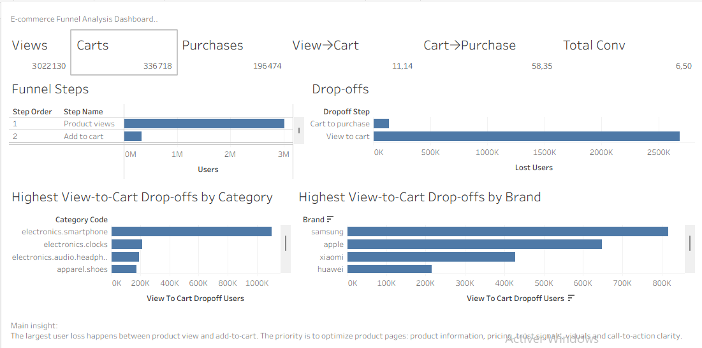

# E-commerce Funnel Analysis — SQL & Tableau Dashboard



**Portfolio project for Data Analyst / BI Analyst roles (alternance).**

This project analyzes an e-commerce conversion funnel from **product view → add-to-cart → purchase** using **SQL**, **Python**, and **Tableau**. It identifies where users drop, quantifies conversion and drop-off, and translates findings into actionable business recommendations.

---

## Stack

| Layer | Role |
|-------|------|
| **SQL / DuckDB** | Schema, cleaning view, strict funnel logic, segment queries |
| **Python / pandas** | Validation and export automation |
| **Tableau** | Dashboard and business visualization |
| **CSV outputs** | Tableau-ready aggregated files (semicolon-delimited for French locale) |

---

## Key results

| Metric | Value |
|--------|------:|
| View users | 3,022,130 |
| Cart users | 336,718 |
| Purchase users | 196,474 |
| View-to-cart rate | 11.14% |
| Cart-to-purchase rate | 58.35% |
| Total conversion rate | 6.50% |

### Main business insight

The **biggest user loss happens between product view and add-to-cart**. Checkout is not the first priority at aggregate level: once users add to cart, **58.35%** complete a purchase.

**Recommended focus:** optimize product pages — product information, pricing, trust signals, visuals, and call-to-action clarity — before over-investing in checkout optimization.

---

## SQL methodology

Strict, time-ordered, **user-level** funnel (see `docs/methodology.md` and `sql/`):

1. **First product view** per user  
2. **First cart event** strictly after that view  
3. **First purchase** strictly after that cart  
4. **Unique users** counted at each step (not raw event volume)  
5. **Conversion rates** and **drop-off user counts** derived from this sequence  

Segment analysis (`category_id`, `brand`) applies the same logic within each segment, with volume filters for stable comparisons.

| SQL file | Purpose |
|----------|---------|
| `01_schema.sql` | Raw table definition |
| `02_load_duckdb.sql` | Load local CSV into DuckDB |
| `03_clean_events.sql` | View `clean_funnel_events` |
| `04_funnel_overall.sql` | Overall funnel KPIs |
| `05_funnel_by_category.sql` | Funnel by category |
| `06_funnel_by_brand.sql` | Funnel by brand |
| `07_qa_checks.sql` | Data quality checks |
| `funnel_queries.sql` | Original overall funnel query (preserved) |

---

## Tableau artifacts

| Asset | Description |
|-------|-------------|
| `dashboard/funnel_analysis_dashboard.png` | Dashboard screenshot for README and portfolio |
| `tableau/ecommerce_funnel_dashboard.twb` | Tableau workbook connected to `outputs/` CSVs |

---

## Outputs (Tableau-ready)

Aggregated files in `outputs/` — generated by `scripts/export_tableau_outputs.py`:

| File | Use in Tableau |
|------|----------------|
| `outputs/funnel_overall.csv` | KPI cards and summary metrics |
| `outputs/funnel_steps.csv` | Funnel chart (long format: step_order, step_name, users) |
| `outputs/funnel_dropoffs.csv` | Drop-off chart (lost users between steps) |
| `outputs/funnel_by_category.csv` | Category segment analysis |
| `outputs/funnel_by_brand.csv` | Brand segment analysis |

> **Note:** The raw full dataset is **not committed** because it is too large (~5 GB). The repository includes **aggregated output files** for Tableau and a **sample dataset** for demonstration. Place the full file locally at `data/ecommerce_events.csv` to regenerate outputs.

---

## Repository structure

```text
funnel-analysis-project/
├── sql/                 # DuckDB schema, cleaning, funnel & QA queries
├── scripts/             # export_tableau_outputs.py (DuckDB → outputs/)
├── outputs/             # Tableau-ready aggregated CSVs
├── dashboard/           # Dashboard screenshot
├── tableau/             # Tableau workbook (.twb)
├── docs/                # methodology.md, data_dictionary.md
├── python/              # analysis.py (pandas validation)
├── data/                # sample CSV + data README
├── requirements.txt
└── README.md
```

---

## Business problem

Growth and acquisition can look healthy while revenue does not keep pace. Without a funnel, teams debate averages. This project answers:

> **Where exactly do users drop before purchase?**

```text
first product view → first cart after view → first purchase after cart
```

---

## Business diagnosis (summary)

### 1. Dominant leak: View → Cart

Only **11.14%** of viewers add to cart. Most users never signal purchase intent. Likely drivers: product discovery, page content, pricing clarity, trust signals, relevance, and CTA strength.

### 2. Cart → Purchase is comparatively strong

**58.35%** of cart users purchase — checkout remains a guardrail KPI, not the first aggregate bottleneck.

### 3. Recommended actions

| Priority | Action | Measure |
|----------|--------|---------|
| 1 | Treat **view → cart** as a primary KPI | Weekly strict funnel tracking |
| 2 | Improve PDPs and listing experience | Uplift in view-to-cart |
| 3 | Prioritize high-traffic weak categories/brands | Segment files in `outputs/` |
| 4 | Monitor cart → purchase as guardrail | Stability while optimizing upstream |
| 5 | Run structured experiments | A/B tests on PDP, CTA, pricing, trust |

---

## How to reproduce

From the repository root.

### 1. Install dependencies

```bash
pip install -r requirements.txt
```

### 2. Full pipeline (SQL → outputs for Tableau)

Place the full dataset locally (not in Git):

```text
data/ecommerce_events.csv
```

Export aggregated CSVs with DuckDB:

```bash
python scripts/export_tableau_outputs.py
```

### 3. Python validation (optional)

Runs on the full file if present, otherwise the sample:

```bash
python python/analysis.py
```

### 4. Tableau

Open `tableau/ecommerce_funnel_dashboard.twb` and connect to semicolon-separated files in `outputs/`.

### 5. SQL only (DuckDB CLI or UI)

Run scripts in order: `01` → `02` → `03` → `04`–`06` → `07`.

---

## Dataset

**Funnel events:** `view`, `cart`, `purchase`

**Full dataset columns:** `event_time`, `event_type`, `product_id`, `category_id`, `category_code`, `brand`, `price`, `user_id`, `user_session` — see `docs/data_dictionary.md`.

**Sample file:** `data/ecommerce_events_sample.csv` — demonstrates the Python pipeline without the full file.

---

## Skills demonstrated

- SQL (CTEs, views, aggregations, segment analysis, QA checks)
- DuckDB (local analytics database, CSV load, export)
- Python (pandas funnel validation, automated export)
- Tableau (KPI dashboard, funnel and drop-off visualization)
- Funnel analysis and conversion metrics
- Business storytelling and recommendations

---

## Interview pitch (one line)

I built a strict SQL-driven e-commerce funnel, exported Tableau-ready metrics, and visualized the journey in Tableau — finding that only **11.14%** of viewers add to cart while **58.35%** of cart users purchase, so the priority is optimizing product pages before checkout.

---

## What I would do next

1. Deep-dive weakest categories and brands (`outputs/funnel_by_*.csv`).  
2. Add weekly funnel trends in SQL.  
3. Compare device or session segments if available in source data.  
4. Run A/B tests on product page elements tied to view-to-cart.  
5. Keep cart-to-purchase as a guardrail KPI.

---

## Documentation

- `docs/methodology.md` — strict funnel rules  
- `docs/data_dictionary.md` — column definitions  
- `outputs/README.md` — output file descriptions  

---

## Conclusion

This project shows an end-to-end **Data / BI Analyst** workflow: **SQL** for trustworthy metrics, **Python** for validation and automation, **Tableau** for decision-ready visualization. The main lesson: improve the step where most users are lost — **product view to add-to-cart** — before scaling traffic or focusing mainly on checkout.
